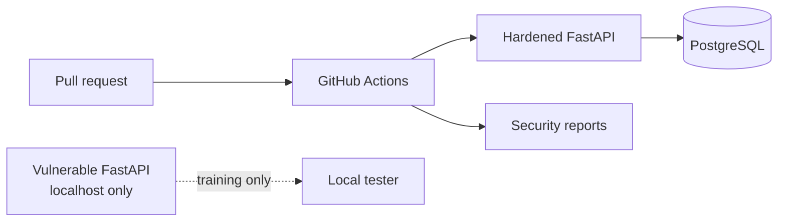

# Architecture

The repository keeps the lab service under `vulnerable/` and the deployable reference under `secure/`. Compose exposes only the hardened service on `127.0.0.1:8000`; the lab profile uses `127.0.0.1:8001`. The current reference repository uses deterministic in-memory fixtures so tests have no external state; PostgreSQL is the production integration boundary and can replace the repository layer without changing route contracts.

Trust boundaries are the client/API boundary, API/database boundary, and CI/tooling boundary. JWT validation, validation, authorization, logging, and response shaping occur before data leaves the API boundary.
