# CI/CD Architecture

```mermaid
flowchart LR
  PR[Pull request] --> L[Lint]
  L --> T[Unit + security tests]
  T --> SAST[SAST]
  SAST --> SCA[SCA]
  SCA --> Secret[Secret scan]
  Secret --> Build[Container build]
  Build --> Trivy[Trivy]
  Trivy --> Deploy[Ephemeral test API]
  Deploy --> ZAP[OWASP ZAP]
  ZAP --> Gate[Threshold gate]
  Gate --> Reports[Artifacts]
```

All scanners run on pull requests and pushes to `main`. Reports are retained as artifacts; the gate fails critical/high findings and configurable medium findings. The workflow uses least-privilege read/security-events permissions and only starts the secure image.
