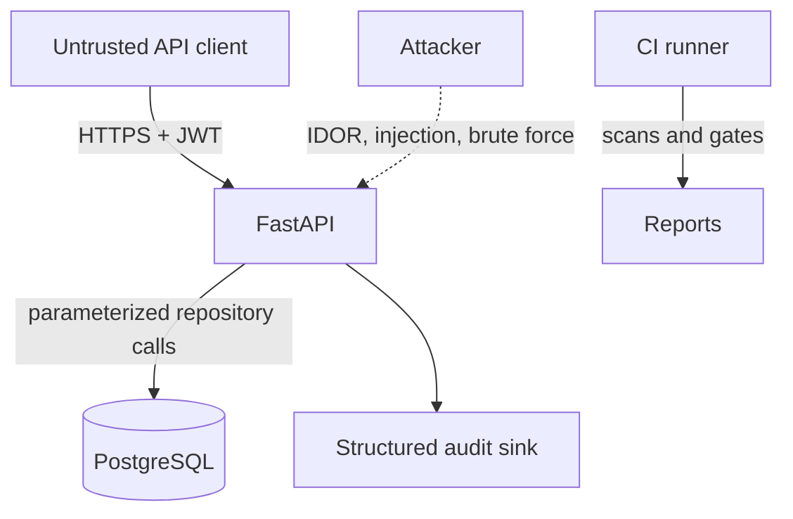

# Threat Model

Assets are identities, orders, audit records, passwords, tokens, and CI artifacts. Actors include anonymous internet clients, authenticated users, administrators, malicious insiders, and compromised dependencies.

Primary threats: credential stuffing, token theft, BOLA/IDOR, mass assignment, injection, sensitive data leakage, excessive requests, log tampering, vulnerable dependencies, and insecure CI configuration. Mitigations are mapped to ASVS in [asvs-checklist.md](asvs-checklist.md).
